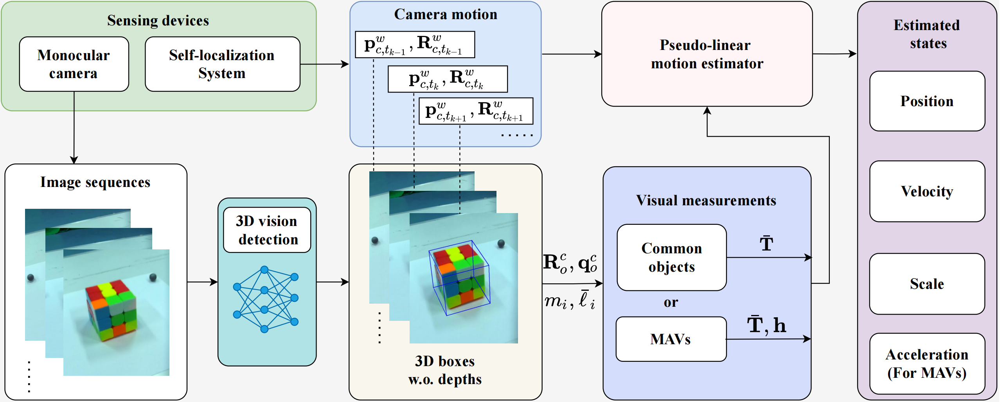
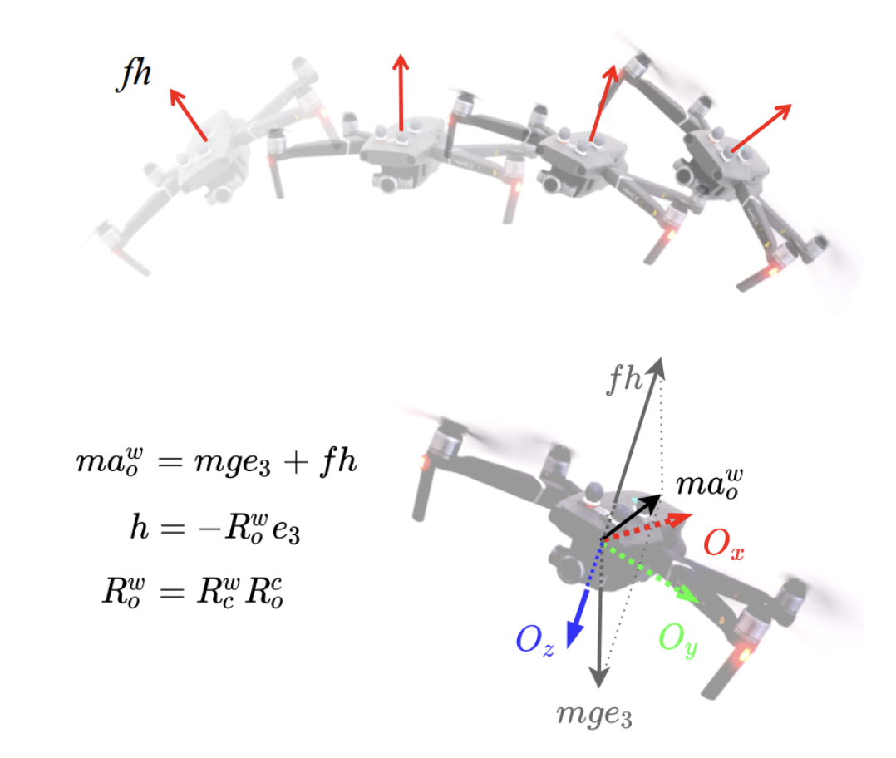

  <h1>Observability-Enhanced Target Motion Estimation via Bearing-Box: Theory and MAV Applications</h1>

  

This is the repository for the paper "Observability-Enhanced Target Motion Estimation via Bearing-Box: Theory and MAV Applications". This paper has been accepted by IEEE Transactions on Robotics.
  
This paper studies the problem of observability-enhanced target motion estimation. We introduce a novel bearing-box approach that fully leverages modern 3D detection measurements that are widely available nowadays but have not been well explored for motion estimation so far. Unlike existing methods that rely on restrictive assumptions such as isotropic target shape and lateral motion, our bearing-box estimator can estimate both the target's motion and its physical size without these assumptions by exploiting the information buried in a 3D bounding box. When applied to multi-rotor micro aerial vehicles (MAVs), the estimator yields an interesting advantage: it further removes the need for higher-order motion assumptions by exploiting the unique coupling between MAV's acceleration and thrust. 

### Framework

### Code
The MATLAB code shows the numerical experiments of the proposed estimator for a target MAV in Section VIII.

